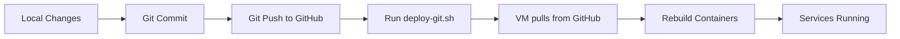

# Git-Based Deployment Guide

**Created:** 2026-01-23  
**Last Updated:** 2026-01-23  
**Purpose:** Guide for deploying ClassArranger using Git (Best Practice)

---

## 🎯 Overview

This guide explains how to deploy code changes using Git instead of manual file transfers. This is the **recommended best practice** for production deployments.

## ✅ Advantages of Git-Based Deployment

| Feature | Git Deployment | Manual (tar + scp) |
|---------|----------------|-------------------|
| **Version Control** | ✅ Full history | ❌ No tracking |
| **Rollback** | ✅ Easy (`git checkout`) | ❌ Manual backup |
| **Audit Trail** | ✅ All changes logged | ❌ No records |
| **Team Collaboration** | ✅ GitHub workflow | ❌ Individual |
| **CI/CD Ready** | ✅ Integrates easily | ❌ Custom scripts |
| **Automation** | ✅ Can automate | ❌ Manual steps |

## 📋 Deployment Workflow



## 🚀 Quick Start

### 1. Make Changes Locally

```bash
cd /path/to/ClassArranger

# Edit your code
vim backend/app/main.py

# Test locally
docker-compose up
```

### 2. Commit and Push

```bash
# Stage changes
git add .

# Commit with meaningful message
git commit -m "feat: add new feature"

# Push to GitHub
git push origin main
```

### 3. Deploy to VM

```bash
# Run the deployment script
./scripts/deploy-git.sh

# Or with custom settings
PROJECT_ID=your-project ZONE=asia-northeast1-a ./scripts/deploy-git.sh
```

## 📝 Deployment Script Details

### `deploy-git.sh`

The deployment script performs these steps:

1. ✅ **Check VM Status** - Ensures VM is running
2. ✅ **Verify Local Changes** - Warns about uncommitted changes
3. ✅ **Pull Latest Code** - Executes `git pull` on VM
4. ✅ **Rebuild Containers** - Runs `docker-compose up -d --build`
5. ✅ **Health Checks** - Tests backend and frontend
6. ✅ **Display Status** - Shows running containers

### Script Options

```bash
# Environment variables you can set
PROJECT_ID=your-project-id          # GCP project ID
ZONE=asia-northeast1-a              # GCP zone
INSTANCE_NAME=classarranger-vm      # VM instance name
GIT_BRANCH=main                     # Git branch to deploy

# Example with custom settings
PROJECT_ID=my-project ZONE=us-central1-a ./scripts/deploy-git.sh
```

## 🔄 Rollback

If something goes wrong, you can easily rollback:

### View Deployment History

```bash
# On your local machine
git log --oneline -n 10

# Example output:
# abc1234 feat: add new feature
# def5678 fix: bug fix
# ghi9012 chore: update dependencies
```

### Rollback to Previous Version

```bash
# Rollback to specific commit
./scripts/rollback-git.sh abc1234

# Rollback to previous commit
./scripts/rollback-git.sh HEAD~1

# Rollback 2 commits back
./scripts/rollback-git.sh HEAD~2
```

### View Current Deployment

```bash
gcloud compute ssh classarranger-vm \
  --zone=asia-northeast1-a \
  --project=project-2a5e0dcf-0fe6-42d1-9be \
  --command="cd /opt/classarranger && git log -1 --oneline"
```

## 🔧 Troubleshooting

### Issue: "You have uncommitted changes"

**Solution:** Commit and push your changes first:
```bash
git add .
git commit -m "your message"
git push origin main
```

### Issue: "Failed to pull latest code"

**Possible causes:**
- Merge conflicts on VM
- Uncommitted changes on VM
- Network issues

**Solution:**
```bash
# SSH into VM
gcloud compute ssh classarranger-vm --zone=asia-northeast1-a

# Check status
cd /opt/classarranger
git status

# If there are conflicts, reset to remote
sudo git fetch origin
sudo git reset --hard origin/main

# Then try deploying again
```

### Issue: "Health check failed after deployment"

**Solution:**
```bash
# Check container logs
gcloud compute ssh classarranger-vm --zone=asia-northeast1-a \
  --command="sudo docker logs classarranger-backend-1 --tail 50"

# Check container status
gcloud compute ssh classarranger-vm --zone=asia-northeast1-a \
  --command="sudo docker ps -a"

# If needed, rollback to previous version
./scripts/rollback-git.sh HEAD~1
```

## 🔐 Private Repositories

If your repository is private, you need to configure Git authentication on the VM:

### Option 1: Personal Access Token (Recommended)

```bash
# On VM
gcloud compute ssh classarranger-vm --zone=asia-northeast1-a

# Configure Git credentials
git config --global credential.helper store
git config --global user.name "Your Name"
git config --global user.email "your-email@example.com"

# Next git pull will ask for credentials (use PAT as password)
cd /opt/classarranger
git pull

# Enter your GitHub username and Personal Access Token
```

### Option 2: SSH Keys

```bash
# On VM, generate SSH key
ssh-keygen -t ed25519 -C "your-email@example.com"

# Display public key
cat ~/.ssh/id_ed25519.pub

# Add this key to GitHub:
# https://github.com/settings/keys

# Update remote URL to use SSH
cd /opt/classarranger
git remote set-url origin git@github.com:seisei-sekai/ClassArranger.git
```

## 🎓 Best Practices

### 1. Meaningful Commit Messages

```bash
# Good examples
git commit -m "feat: add user authentication"
git commit -m "fix: resolve database connection timeout"
git commit -m "docs: update deployment guide"

# Follow conventional commits:
# feat:     new feature
# fix:      bug fix
# docs:     documentation
# style:    formatting
# refactor: code restructuring
# test:     adding tests
# chore:    maintenance
```

### 2. Test Before Pushing

```bash
# Always test locally first
docker-compose up --build

# Check for errors in logs
docker-compose logs

# Test the application
curl http://localhost:8000/health
```

### 3. Small, Frequent Deployments

✅ **Good:** Deploy small changes frequently  
❌ **Bad:** Accumulate large changes and deploy all at once

### 4. Use Branches for Features

```bash
# Create feature branch
git checkout -b feature/new-authentication

# Make changes, commit
git commit -m "feat: add OAuth support"

# Push feature branch
git push origin feature/new-authentication

# After review, merge to main
git checkout main
git merge feature/new-authentication
git push origin main

# Deploy
./scripts/deploy-git.sh
```

### 5. Monitor After Deployment

```bash
# Watch logs in real-time
gcloud compute ssh classarranger-vm --zone=asia-northeast1-a \
  --command="sudo docker logs -f classarranger-backend-1"

# Check metrics
gcloud compute ssh classarranger-vm --zone=asia-northeast1-a \
  --command="sudo docker stats --no-stream"
```

## 📊 Deployment Checklist

Before deploying:
- [ ] Changes tested locally
- [ ] All tests passing
- [ ] Code committed with meaningful message
- [ ] Code pushed to GitHub
- [ ] No uncommitted changes
- [ ] Deployment script ready

After deploying:
- [ ] Health checks passed
- [ ] Frontend accessible
- [ ] Backend API responding
- [ ] No errors in logs
- [ ] Monitor for 5-10 minutes

## 🔗 Related Documentation

- [Beginner Deploy Guide](./beginner-deploy-guide.md) - Initial setup
- [Terraform Guide](./terraform-guide.md) - Infrastructure setup
- [Local MongoDB Guide](./local-mongodb-guide.md) - Database setup
- [Quick Deploy](./quick-deploy.md) - Fast deployment reference

## 💡 Next Steps

### Upgrade to CI/CD (Advanced)

For automatic deployments on every push:

1. **GitHub Actions**: Automatically deploy on merge to main
2. **Cloud Build**: Build and deploy using GCP
3. **Container Registry**: Store pre-built Docker images

See [CI/CD Setup Guide](./cicd-setup-guide.md) (coming soon)

---

## 📞 Support

If you encounter issues:
1. Check logs: `sudo docker logs classarranger-backend-1`
2. Verify VM status: `gcloud compute instances list`
3. Check Git status: `cd /opt/classarranger && git status`
4. Rollback if needed: `./scripts/rollback-git.sh HEAD~1`

**Remember:** Git-based deployment is the best practice for production systems! 🎉

