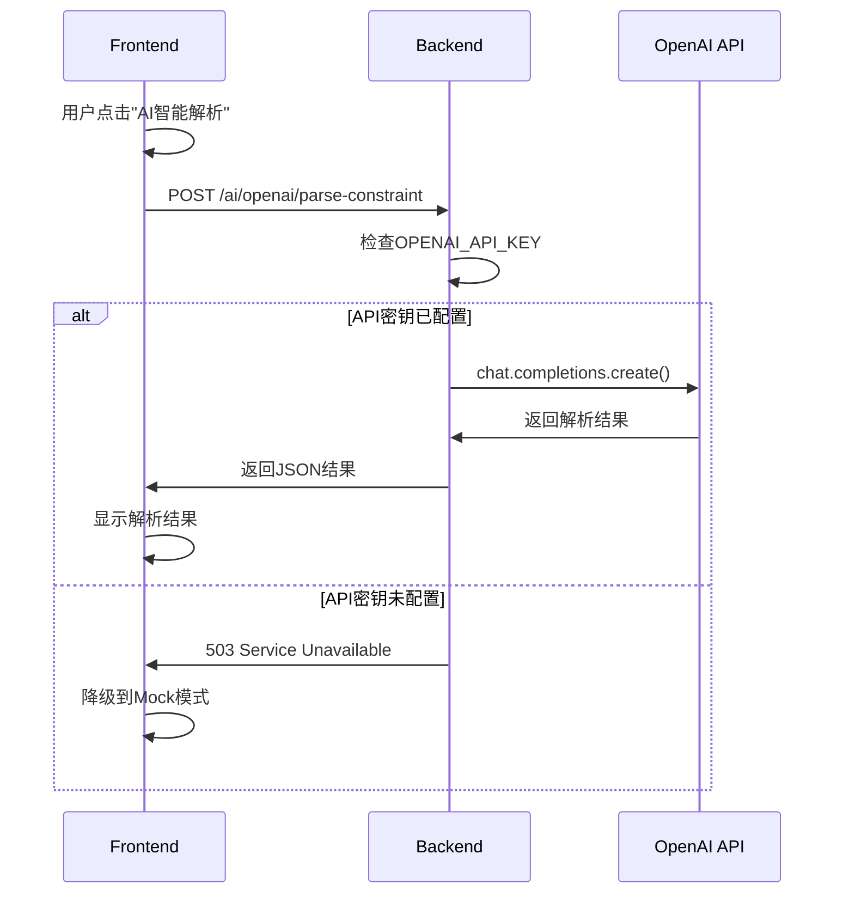

# OpenAI API 配置指南

**Created:** 2026-02-02
**Last Updated:** 2026-02-02
**Purpose:** 如何配置OpenAI API以启用AI智能解析功能

---

## 概述

Experiment3的"AI智能解析"功能使用OpenAI API来解析学生的复杂约束条件。如果不配置API密钥，系统会自动使用Mock模式。

---

## 获取API密钥

### 1. 访问OpenAI平台

访问：https://platform.openai.com/api-keys

### 2. 登录/注册

- 如果没有账号，需要先注册
- 需要绑定支付方式（信用卡）

### 3. 创建API密钥

1. 点击"Create new secret key"
2. 给密钥起个名字（如"XDF Class Arranger"）
3. **立即复制密钥**（只显示一次！）
4. 安全保存密钥

---

## 配置方法

### 方法1: 本地开发环境

#### 步骤1: 编辑`.env`文件

```bash
cd /Users/benz/Desktop/Stanford/SP26/新东方/XDF
nano .env  # 或使用其他编辑器
```

#### 步骤2: 添加API密钥

找到这一行：
```env
OPENAI_API_KEY=
```

修改为：
```env
OPENAI_API_KEY=sk-proj-xxxxxxxxxxxxxxxxxxxx
```

（替换为你的实际API密钥）

#### 步骤3: 重启后端服务

```bash
# 如果使用Docker Compose
docker-compose restart backend

# 如果直接运行Python
# 停止后端（Ctrl+C），然后重新启动
cd backend
uvicorn app.main:app --reload
```

---

### 方法2: Docker生产环境

#### 步骤1: 编辑`.env`文件

```bash
nano .env
```

添加：
```env
OPENAI_API_KEY=sk-proj-xxxxxxxxxxxxxxxxxxxx
```

#### 步骤2: 重启服务

```bash
docker-compose down
docker-compose up -d
```

---

### 方法3: 直接设置环境变量（临时）

```bash
# Linux/Mac
export OPENAI_API_KEY=sk-proj-xxxxxxxxxxxxxxxxxxxx
uvicorn app.main:app --reload

# Windows (PowerShell)
$env:OPENAI_API_KEY="sk-proj-xxxxxxxxxxxxxxxxxxxx"
uvicorn app.main:app --reload
```

---

## 验证配置

### 1. 检查后端日志

启动后端后，查看日志：
```
✅ OpenAI service initialized (using backend proxy)
```

### 2. 访问健康检查端点

```bash
curl http://localhost:8000/ai/health
```

应该返回：
```json
{
  "status": "healthy",
  "service": "mock-ai",
  "version": "1.0.0",
  "openai_configured": true  // ✅ 这里应该是true
}
```

### 3. 测试AI解析功能

1. 访问Experiment3页面
2. 导入学生数据
3. 点击"约束管理"
4. 点击"AI智能解析"
5. 如果配置正确，应该能看到解析进度和结果

---

## 错误排查

### 错误1: 503 Service Unavailable

**错误信息**:
```
❌ 后端OpenAI API未配置！
请联系管理员在服务器端配置 OPENAI_API_KEY 环境变量。
```

**原因**: API密钥未配置或未生效

**解决**:
1. 确认`.env`文件中有`OPENAI_API_KEY`
2. 确认密钥格式正确（以`sk-`开头）
3. 重启后端服务
4. 检查后端日志

### 错误2: 401 Unauthorized

**错误信息**:
```
OpenAI API call failed
401: Incorrect API key provided
```

**原因**: API密钥无效或过期

**解决**:
1. 检查密钥是否正确复制（没有多余空格）
2. 登录OpenAI平台检查密钥状态
3. 如果密钥被删除，创建新密钥

### 错误3: 429 Rate Limit

**错误信息**:
```
OpenAI API call failed
429: Rate limit exceeded
```

**原因**: 超过API使用限额

**解决**:
1. 等待一段时间后重试
2. 检查OpenAI账户余额
3. 升级API计划（如果需要）

### 错误4: 500 Internal Server Error

**错误信息**:
```
OpenAI API call failed
500: The server had an error processing your request
```

**原因**: OpenAI服务暂时不可用

**解决**:
1. 等待几分钟后重试
2. 检查OpenAI状态页面：https://status.openai.com/
3. 如果持续出错，使用Mock模式

---

## Mock模式

如果不想使用OpenAI API，系统会自动使用Mock模式：

### Mock模式特点

✅ **优点**:
- 无需API密钥
- 无费用
- 响应速度快
- 适合开发测试

❌ **限制**:
- 解析结果是预设的示例
- 不能处理复杂约束
- 仅用于演示和测试

### 启用Mock模式

保持`.env`文件中的`OPENAI_API_KEY`为空：
```env
OPENAI_API_KEY=
```

前端会自动检测并显示：
```
🤖 使用Mock模式（演示）
```

---

## 费用估算

### OpenAI定价（2026-02）

**gpt-4o-mini模型**（系统默认使用）:
- 输入：$0.15 / 1M tokens
- 输出：$0.60 / 1M tokens

### 典型使用场景

**解析一个学生的约束**:
- 输入：~500 tokens
- 输出：~200 tokens
- 费用：约$0.0002（0.02分人民币）

**解析100个学生**:
- 总费用：约$0.02（2分人民币）

### 成本控制

1. **批量处理**: 一次解析多个学生，降低API调用次数
2. **缓存结果**: 解析后保存结果，避免重复解析
3. **使用更便宜的模型**: 如`gpt-3.5-turbo`（但准确度可能下降）

---

## 安全建议

### DO ✅

1. **使用环境变量**: 永远不要在代码中硬编码API密钥
2. **限制权限**: 只给API密钥必要的权限
3. **定期轮换**: 定期更换API密钥
4. **监控使用**: 定期检查API使用量和费用
5. **设置预算**: 在OpenAI平台设置月度预算限制

### DON'T ❌

1. **不要提交到Git**: `.env`文件应在`.gitignore`中
2. **不要共享**: 不要在聊天、邮件中发送API密钥
3. **不要暴露**: 不要在前端代码中暴露密钥
4. **不要使用明文**: 生产环境使用密钥管理服务
5. **不要忽视告警**: 如果收到异常使用告警，立即检查

---

## 配置文件位置

### 开发环境
```
/Users/benz/Desktop/Stanford/SP26/新东方/XDF/.env
```

### Docker环境
```
/Users/benz/Desktop/Stanford/SP26/新东方/XDF/.env
（docker-compose.yml会读取这个文件）
```

### 后端配置
```
backend/app/core/config.py  （定义配置项）
backend/app/api/routes/ai.py  （使用API密钥）
```

---

## 常见问题

### Q1: 是否必须配置OpenAI API？

**A**: 不是必须的。如果不配置，系统会自动使用Mock模式，但AI解析功能只能返回示例结果。

### Q2: 可以使用其他AI服务吗？

**A**: 目前只支持OpenAI。如需支持其他服务（如Claude、本地LLM等），需要修改后端代码。

### Q3: API密钥会过期吗？

**A**: OpenAI API密钥不会自动过期，但可以在平台上手动撤销。建议定期轮换密钥。

### Q4: 如何限制API使用费用？

**A**: 在OpenAI平台的"Usage limits"中设置月度预算上限。

### Q5: 可以使用免费额度吗？

**A**: OpenAI新用户有免费额度（通常$5），用完后需要充值。

---

## 技术细节

### API调用流程



### 请求格式

```python
{
    "system_prompt": "你是一个排课约束解析助手...",
    "user_prompt": "学生信息：...",
    "model": "gpt-4o-mini",
    "temperature": 0
}
```

### 响应格式

```json
{
    "content": "{\"parsedConstraints\": [...]}",
    "model": "gpt-4o-mini-2024-07-18",
    "usage": {
        "prompt_tokens": 523,
        "completion_tokens": 187,
        "total_tokens": 710
    }
}
```

---

## 参考链接

- **OpenAI平台**: https://platform.openai.com/
- **API文档**: https://platform.openai.com/docs/api-reference
- **定价信息**: https://openai.com/api/pricing/
- **状态页面**: https://status.openai.com/
- **使用指南**: https://platform.openai.com/docs/guides/text-generation

---

**配置完成后，记得重启后端服务！**

```bash
# Docker方式
docker-compose restart backend

# 直接运行方式
# Ctrl+C停止，然后重新运行
cd backend
uvicorn app.main:app --reload
```
