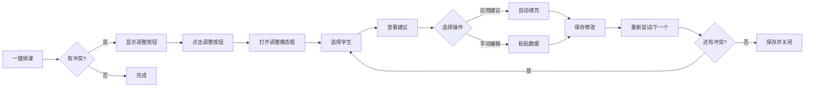

# 排课调整系统实施总结

**Created:** 2026-02-03
**Last Updated:** 2026-02-03
**Purpose:** 记录排课调整功能模块的完整实现

---

## 概述

实现了"排课调整"功能模块，用于迭代式解决排课冲突和未排课学生问题。采用模块化架构，提供智能建议，支持数据修改标记和历史追踪。

## 架构设计

### 模块结构

```
frontend/src/XdfClassArranger/Experiment3/
├── types/
│   └── adjustmentTypes.js              # 类型定义（冲突、建议、修改记录）
├── utils/
│   ├── conflictAnalyzer.js             # 冲突分析工具
│   └── suggestionEngine.js             # 智能建议生成引擎
├── services/
│   └── scheduleAdjustmentService.js    # 核心业务逻辑服务
└── components/
    └── ScheduleAdjustment/
        ├── ScheduleAdjustmentModal.jsx     # 主模态框
        ├── ScheduleAdjustmentModal.css
        ├── StudentConflictList.jsx         # 冲突列表
        ├── StudentConflictList.css
        ├── AdjustmentPanel.jsx             # 调整面板
        ├── AdjustmentPanel.css
        ├── SmartSuggestions.jsx            # 智能建议
        ├── SmartSuggestions.css
        ├── AdjustmentHistory.jsx           # 修改历史
        └── AdjustmentHistory.css
```

### 组件层次

```
ScheduleAdjustmentModal (主模态框)
├── StudentConflictList (左侧列表 30%)
└── AdjustmentPanel (右侧调整区 70%)
    ├── 学生信息区 (20%)
    ├── SmartSuggestions (智能建议 50%)
    └── 手动编辑区 (30%)
        └── 操作按钮组
```

## 核心功能

### 1. 冲突类型识别

系统自动识别6种冲突类型：

| 冲突类型 | 识别关键词 | 严重程度 |
|---------|-----------|---------|
| NO_TEACHER | "没有教师"、"无教师" | 高 |
| NO_SUBJECT | "科目"、"教授" | 高 |
| HOUR_LIMIT | "课时上限"、"周课时" | 高 |
| NO_TIME | "没有共同时间"、"时间段" | 中 |
| NO_ROOM | "无可用教室"、"教室" | 低 |
| OTHER | 其他 | 根据学生课时判断 |

### 2. 智能建议生成

根据冲突类型自动生成4类建议：

#### 时间槽建议 (TIME)
- 分析学生和教师的共同空闲时间
- 计算时间槽置信度（基于时长、冲突情况）
- 返回前5个最佳时间槽

#### 教师建议 (TEACHER)
- 筛选可教该科目和校区的教师
- 计算教师工作负载（使用率）
- 基于负载和可用时间计算置信度
- 返回前3个推荐教师

#### 教室建议 (ROOM)
- 筛选同校区教室
- 计算教室使用率
- 使用率越低，置信度越高
- 返回前3个推荐教室

#### 约束建议 (CONSTRAINT)
- 增加教师周课时上限
- 放宽学生时间约束
- 调整学生课时需求

### 3. 数据修改追踪

**修改标记**：
- 每个修改的对象添加 `isModified: true`
- 存储完整的 `modificationHistory` 数组

**修改记录结构**：
```javascript
{
  id: "modification-xxx",
  timestamp: Date,
  targetType: 'student' | 'teacher' | 'classroom',
  targetId: "target-id",
  targetName: "目标名称",
  field: "字段名",
  oldValue: "旧值",
  newValue: "新值",
  reason: "修改原因",
  conflictId: "关联的冲突ID"
}
```

### 4. 流程控制

**触发方式**：
- 点击"一键排课"后，如果有冲突，系统保存冲突数据
- 悬浮的"排课调整"按钮出现在右下角（一键排课按钮上方）
- 点击按钮打开调整模态框

**调整流程**：
1. 用户从左侧列表选择冲突学生
2. 右侧显示学生信息、冲突原因、智能建议
3. 用户可以：
   - 应用智能建议（自动填充数据）
   - 手动编辑数据（粘贴Excel）
   - 填写修改原因（必填）
   - 保存修改（标记为已修改）
4. 用户选择操作：
   - "重新尝试"：为当前学生单独排课
   - "跳过"：标记为已跳过
   - "下一个"：跳转到下一个待处理学生
   - "批量重试"（底部）：批量重新排课所有未解决的冲突

**成功处理**：
- 排课成功后显示成功提示
- 用户手动点击"下一个"继续

### 5. 数据持久化

**LocalStorage更新**：
- Schema版本升级到 V3
- 新增 `xdf_adjustment_history` 键存储调整历史
- 学生/老师/教室对象的 `isModified` 和 `modificationHistory` 字段自动保存
- 提供 `adjustmentHistoryStorage` 访问器：
  - `save(history)` - 保存历史
  - `load()` - 加载历史
  - `addRecord(record)` - 添加单条记录
  - `getRecordsByConflict(conflictId)` - 查询指定冲突的记录

## UI/UX 设计

### 视觉样式

**配色方案**：
- 高严重度：`#FF3B30`（红色）
- 中严重度：`#FF9500`（橙色）
- 低严重度：`#FFCC00`（黄色）
- 已修改标记：`#007AFF`（蓝色）
- 已解决：`#34C759`（绿色）

**悬浮按钮**：
- 位置：右下角，在"一键排课"按钮上方（bottom: 6rem）
- 渐变色：橙色系（#FF9500 → #FF6B00）
- 动画：从右侧滑入（slideInRight）
- 悬停：向上浮起4px，增强阴影

**模态框**：
- 全屏居中，95vw × 90vh
- 最大宽度：1600px
- 圆角：12px
- 动画：从下方滑入（slideUp）

### 交互细节

**冲突列表**：
- 左侧边框颜色表示严重程度
- 选中时蓝色边框和背景高亮
- 显示状态徽章（待处理/进行中/已解决/已跳过）
- "已修改"蓝色徽章
- 悬停效果：浮起2px + 阴影

**智能建议**：
- 标签页切换（全部/时间/教师/教室/约束）
- 置信度条：绿色渐变（高）、橙色（中）、黄色（低）
- 应用按钮：蓝色渐变，悬停浮起

**修改历史**：
- 侧边滑出面板（右侧，500px宽）
- 时间线样式，带连接线和圆点
- 修改前值：红色删除线
- 修改后值：绿色加粗

## 文件清单

### 新增文件（12个）

**核心逻辑**：
1. `frontend/src/XdfClassArranger/Experiment3/types/adjustmentTypes.js` - 类型定义
2. `frontend/src/XdfClassArranger/Experiment3/utils/conflictAnalyzer.js` - 冲突分析
3. `frontend/src/XdfClassArranger/Experiment3/utils/suggestionEngine.js` - 建议引擎
4. `frontend/src/XdfClassArranger/Experiment3/services/scheduleAdjustmentService.js` - 核心服务

**UI组件**：
5. `frontend/src/XdfClassArranger/Experiment3/components/ScheduleAdjustment/ScheduleAdjustmentModal.jsx`
6. `frontend/src/XdfClassArranger/Experiment3/components/ScheduleAdjustment/StudentConflictList.jsx`
7. `frontend/src/XdfClassArranger/Experiment3/components/ScheduleAdjustment/AdjustmentPanel.jsx`
8. `frontend/src/XdfClassArranger/Experiment3/components/ScheduleAdjustment/SmartSuggestions.jsx`
9. `frontend/src/XdfClassArranger/Experiment3/components/ScheduleAdjustment/AdjustmentHistory.jsx`

**样式文件**：
10. `frontend/src/XdfClassArranger/Experiment3/components/ScheduleAdjustment/ScheduleAdjustmentModal.css`
11. `frontend/src/XdfClassArranger/Experiment3/components/ScheduleAdjustment/StudentConflictList.css`
12. `frontend/src/XdfClassArranger/Experiment3/components/ScheduleAdjustment/AdjustmentPanel.css`
13. `frontend/src/XdfClassArranger/Experiment3/components/ScheduleAdjustment/SmartSuggestions.css`
14. `frontend/src/XdfClassArranger/Experiment3/components/ScheduleAdjustment/AdjustmentHistory.css`

### 修改的文件（3个）

1. `frontend/src/XdfClassArranger/Experiment3/Experiment3.jsx`
   - 导入 `ScheduleAdjustmentModal`
   - 添加状态：`showAdjustmentModal`、`adjustmentConflicts`
   - 在 `handleOneClickSchedule` 中保存冲突数据
   - 添加悬浮"排课调整"按钮
   - 添加 `ScheduleAdjustmentModal` 组件
   - 实现 `onSuccess` 回调（更新数据、context、localStorage）

2. `frontend/src/XdfClassArranger/Experiment3/Experiment3.css`
   - 添加 `.floating-adjustment-btn` 样式
   - 添加 `slideInRight` 动画

3. `frontend/src/XdfClassArranger/services/localStorageService.js`
   - 添加 `ADJUSTMENT_HISTORY` 存储键
   - 升级 schema 版本到 V3
   - 添加 `adjustmentHistoryStorage` 访问器
   - 更新 default export

## 使用流程

### 基本流程



### 详细操作步骤

1. **触发调整**
   - 点击"一键排课"执行排课
   - 如果有冲突，右下角出现"🔧 排课调整"按钮
   - 按钮显示冲突数量徽章

2. **打开调整面板**
   - 点击"排课调整"按钮
   - 全屏模态框打开
   - 左侧显示冲突学生列表
   - 默认选中第一个待处理学生

3. **查看冲突详情**
   - 右侧显示学生完整信息
   - 显示冲突原因描述
   - 自动生成智能建议

4. **应用建议或手动修改**
   
   **方式一：应用智能建议**
   - 切换标签页查看不同类型建议
   - 查看置信度条
   - 点击"应用建议"
   - 确认对话框
   - 数据自动填充并标记为已修改

   **方式二：手动编辑**
   - 选择编辑目标（学生/教师/教室）
   - 粘贴Excel数据或手动输入
   - 填写修改原因（必填）
   - 点击"保存修改"

5. **重新尝试排课**
   - 点击"重新尝试"按钮
   - 系统只为当前学生执行排课算法
   - 显示成功或失败结果
   - 如果成功，显示成功提示

6. **继续处理**
   - 点击"下一个"跳转到下一个待处理学生
   - 或点击"跳过"标记当前学生为已跳过
   - 或点击底部"批量重试"批量处理所有待处理学生

7. **查看修改历史**
   - 点击"历史"按钮
   - 右侧滑出历史面板
   - 时间线样式显示所有修改
   - 支持按类型筛选

8. **保存并关闭**
   - 点击底部"保存修改"
   - 确认对话框
   - 所有修改的数据更新到主页面
   - 自动保存到localStorage
   - 模态框关闭

## 技术要点

### 1. 模块化设计

- **单一职责**：每个组件和工具类只负责一项功能
- **清晰分层**：类型定义 → 工具类 → 服务层 → UI组件
- **低耦合**：通过接口和回调函数通信

### 2. 服务层抽象

`ScheduleAdjustmentService` 类：
- 封装所有业务逻辑
- 管理冲突状态和建议
- 处理数据修改和标记
- 提供事件监听机制
- 协调算法调用

### 3. 智能建议算法

**置信度计算**：
- 时间槽：基于时长 + 是否有冲突
- 教师：基于工作负载 + 可用时间数量
- 教室：基于使用率
- 约束：固定置信度（0.5-0.7）

**建议排序**：
- 所有建议按置信度降序排列
- 每类建议限制数量（避免信息过载）

### 4. 数据不可变性

- 构造函数中深拷贝原始数据
- 修改时创建新对象
- 保留原始数据快照（支持撤销）
- 修改历史完整记录

### 5. 用户体验优化

**迭代式流程**：
- 一次只处理一个学生
- 用户完全控制流程
- 避免自动化误操作

**智能提示**：
- 全面的建议（时间/教师/教室/约束）
- 清晰的置信度显示
- 详细的描述和原因

**视觉反馈**：
- 颜色区分严重程度
- 状态徽章实时更新
- 进度统计（已解决/待处理）
- 修改标记清晰可见

**可追溯性**：
- 完整的修改历史时间线
- 修改前后值对比
- 修改原因记录
- 支持按类型筛选

## 待优化项

以下功能已预留接口，可后续增强：

1. **AI建议增强**
   - 调用OpenAI API进行深度分析
   - 生成更智能的解决方案
   - 提供多种可行方案对比

2. **撤销功能**
   - 基于修改历史实现撤销
   - 支持单个撤销和批量撤销
   - 撤销后重新生成建议

3. **导出功能**
   - 导出调整报告
   - 包含所有修改记录
   - 生成审计日志

4. **建议应用实现**
   - 完善 `applyAction` 回调逻辑
   - 实现具体的数据转换
   - 添加应用失败的错误处理

## 测试建议

### 手动测试流程

1. **基础流程测试**
   - 生成测试数据
   - 执行一键排课
   - 确认有冲突
   - 点击"排课调整"按钮
   - 验证模态框打开

2. **冲突识别测试**
   - 验证各种冲突类型正确识别
   - 验证严重程度计算正确
   - 验证冲突统计准确

3. **建议生成测试**
   - 验证时间槽建议合理
   - 验证教师建议符合条件
   - 验证置信度计算正确

4. **数据修改测试**
   - 应用建议，验证数据更新
   - 手动修改，验证保存成功
   - 验证修改标记显示
   - 验证修改历史记录

5. **重新排课测试**
   - 单个重试，验证结果
   - 批量重试，验证统计
   - 验证成功后状态更新

6. **筛选和排序测试**
   - 按严重程度筛选
   - 按状态筛选
   - 按严重程度/姓名排序

7. **持久化测试**
   - 修改数据后刷新页面
   - 验证 `isModified` 字段保留
   - 验证修改历史保留
   - 验证调整历史记录保留

## 注意事项

1. **算法适配器传递**
   - 当前 `algorithmAdapter` 参数传递为 `null`
   - 需要在模态框内部创建适配器实例
   - 或从父组件传递实例

2. **Excel数据解析**
   - 手动编辑区的数据解析逻辑需要实现
   - 参考现有的 `parseStudentRows`、`parseTeacherRows` 等函数

3. **建议应用逻辑**
   - `suggestionEngine.js` 中的 `applyAction` 回调当前为占位实现
   - 需要根据实际需求完善具体逻辑

4. **深色模式支持**
   - 所有CSS已包含深色模式适配
   - 使用CSS变量确保主题一致性

5. **响应式设计**
   - 小屏幕下左右分栏变为上下布局
   - 历史面板在小屏幕下占满宽度

---

## 后续开发

建议按以下优先级完善功能：

1. **P0**：完善建议应用逻辑（目前为占位实现）
2. **P0**：实现手动编辑区的Excel数据解析
3. **P1**：添加撤销功能
4. **P1**：集成AI分析API
5. **P2**：添加导出调整报告功能
6. **P2**：添加单元测试

---

**实施日期**：2026-02-03
**实施版本**：Schema V3
**代码行数**：约2000+ 行（包括注释和文档）
