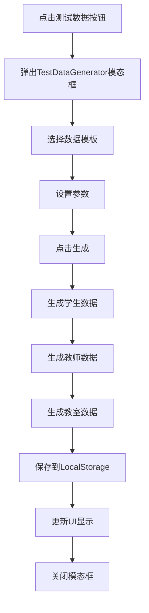
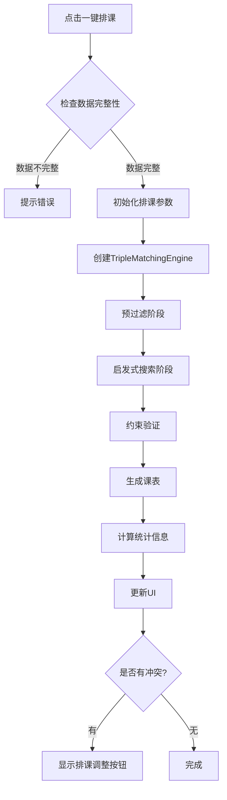
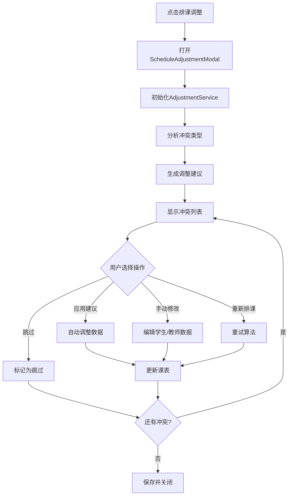

# 排课系统核心功能技术文档

**Created:** 2026-02-05
**Last Updated:** 2026-02-05
**Purpose:** 详细解释测试数据、一键排课、排课调整三个核心按钮的技术实现

---

## 目录

- [系统架构概览](#系统架构概览)
- [数据结构层](#数据结构层)
- [约束系统层](#约束系统层)
- [功能1: 测试数据生成](#功能1-测试数据生成)
- [功能2: 一键排课](#功能2-一键排课)
- [功能3: 排课调整](#功能3-排课调整)
- [核心算法详解](#核心算法详解)

---

## 系统架构概览

### 整体分层架构

```
┌─────────────────────────────────────────────────────┐
│                   UI Layer (用户界面层)                │
│  - 测试数据按钮  - 一键排课按钮  - 排课调整按钮       │
└─────────────────────────────────────────────────────┘
                          ↓
┌─────────────────────────────────────────────────────┐
│              Service Layer (业务逻辑层)               │
│  - TestDataGenerator                                │
│  - TripleMatchingEngine                             │
│  - ScheduleAdjustmentService                        │
└─────────────────────────────────────────────────────┘
                          ↓
┌─────────────────────────────────────────────────────┐
│            Constraint Layer (约束系统层)              │
│  - ConstraintEngine                                 │
│  - ConstraintTypes (硬约束/软约束)                   │
│  - Constraint Validation                            │
└─────────────────────────────────────────────────────┘
                          ↓
┌─────────────────────────────────────────────────────┐
│             Data Layer (数据持久化层)                 │
│  - LocalStorage Service                             │
│  - Student/Teacher/Classroom Models                 │
└─────────────────────────────────────────────────────┘
```

---

## 数据结构层

### 1. 学生数据结构 (Student)

```javascript
{
  id: 'student-1234567890',           // 唯一标识
  name: '学生A',                      // 学生姓名
  color: '#84A9A9',                   // 显示颜色
  rawData: '学生A\t...\t',           // Excel原始数据（Tab分隔）
  parsedData: {                       // NLP解析后的约束数据
    success: true,
    constraints: [...],
    allowedDays: [1,2,3,4,5],        // 可用星期
    allowedTimeRanges: [{             // 可用时间段
      day: 1,
      start: 36,                      // 时间槽索引
      end: 72
    }],
    excludedTimeRanges: []           // 排除时间段
  },
  showAvailability: false,            // 是否在日历显示
  selected: true,                     // 是否被选中排课
  courseHours: {                      // 课时信息
    totalHours: 30,
    usedHours: 0,
    remainingHours: 30
  },
  constraints: []                     // 自定义约束数组
}
```

### 2. 教师数据结构 (Teacher)

```javascript
{
  id: 'teacher-1234567890',
  name: '田中老师',
  subjects: ['日语', 'JLPT', 'EJU'],  // 可教科目
  campuses: ['新宿', '涩谷'],         // 可授课校区
  availability: [                     // 7x150 可用性矩阵
    [true, true, false, ...],         // 周一
    [true, true, true, ...],          // 周二
    // ...
  ],
  maxHoursPerWeek: 30,                // 每周最大课时
  currentHours: 0                     // 当前已排课时
}
```

### 3. 教室数据结构 (Classroom)

```javascript
{
  id: 'classroom-001',
  name: '新宿-A101',
  campus: '新宿',                     // 所属校区
  capacity: 4,                        // 容量
  facilities: ['投影仪', '白板'],     // 设施
  availability: [                     // 7x150 可用性矩阵
    [true, true, true, ...],
    // ...
  ]
}
```

### 4. 课程数据结构 (Course)

```javascript
{
  id: 'course-1234567890',
  student: {                          // 学生信息
    id: 'student-xxx',
    name: '学生A'
  },
  teacher: {                          // 教师信息
    id: 'teacher-xxx',
    name: '田中老师'
  },
  classroom: {                        // 教室信息
    id: 'classroom-xxx',
    name: '新宿-A101'
  },
  subject: '日语',                    // 科目
  timeSlot: {                         // 时间槽
    day: 1,                           // 0=周日, 1=周一, ...
    startSlot: 36,                    // 开始槽 (9:00 = 36)
    start: '09:00',                   // 开始时间
    end: '10:30'                      // 结束时间
  },
  duration: 24,                       // 时长（槽数，24槽=1.5小时）
  campus: '新宿',                     // 校区
  score: 95.5                         // 约束评分
}
```

---

## 约束系统层

### 约束分类

#### 1. 硬约束 (Hard Constraints) - 必须满足

| 约束类型 | 名称 | 权重 | 说明 |
|---------|------|------|------|
| `TIME_CONFLICT` | 时间冲突 | 50 | 学生/教师/教室同一时间不能有多个课程 |
| `TEACHER_AVAILABILITY` | 教师可用性 | 40 | 课程必须在教师可用时间段 |
| `STUDENT_AVAILABILITY` | 学生可用性 | 40 | 课程必须在学生可用时间段 |
| `CLASSROOM_CAPACITY` | 教室容量 | 35 | 教室容量必须满足需求 |
| `SUBJECT_MATCH` | 科目匹配 | 30 | 教师必须能教授该科目 |
| `CAMPUS_MATCH` | 校区匹配 | 25 | 课程必须在指定校区 |
| `COURSE_DURATION` | 课程时长 | 20 | 满足课程时长要求 |
| `DEADLINE_CONSTRAINT` | 截止日期 | 15 | 满足截止日期要求 |

#### 2. 软约束 (Soft Constraints) - 建议满足

| 约束类型 | 名称 | 权重 | 说明 |
|---------|------|------|------|
| `PREFERRED_TIME` | 偏好时间 | 10 | 优先安排在偏好时间 |
| `CONSECUTIVE_LIMIT` | 连续上课限制 | 8 | 避免连续过多课程 |
| `LUNCH_BREAK` | 午休时间 | 6 | 避免12:00-13:00安排课程 |
| `TEACHER_PREFERENCE` | 教师偏好 | 5 | 优先使用指定教师 |
| `DISTRIBUTION` | 课程分散度 | 5 | 课程均匀分布在一周内 |
| `EARLY_MORNING` | 早晨课程 | 3 | 避免过早课程 |
| `LATE_EVENING` | 晚间课程 | 3 | 避免过晚课程 |
| `SAME_DAY_CAMPUS` | 同日同校区 | 4 | 同一天在同一校区 |

### 约束引擎 (ConstraintEngine)

```javascript
class ConstraintEngine {
  // 核心方法
  
  // 1. 注册约束
  registerConstraint(id, constraint) {
    // 将约束添加到系统
  }
  
  // 2. 验证单个约束
  validate(schedule, constraintId, data) {
    // 检查课表是否满足指定约束
    // 返回: { valid: boolean, violations: number }
  }
  
  // 3. 计算总违规分数
  calculateViolationScore(schedule, data) {
    // 检查所有启用的约束
    // 返回: {
    //   score: 100 - Σ(violations × weight),
    //   violations: { constraintId: count },
    //   details: [...],
    //   totalViolations: number
    // }
  }
  
  // 4. 时间冲突检查
  checkTimeConflicts(schedule) {
    // 双重循环检查任意两门课程是否冲突
    // 检查: 学生冲突、教师冲突、教室冲突
  }
  
  // 5. 启用/禁用约束
  setConstraintEnabled(constraintId, enabled)
  
  // 6. 更新约束权重
  setConstraintWeight(constraintId, weight)
}
```

### 约束评分机制

**评分公式：**

```
总分 = 100 - Σ(违规次数 × 约束权重)

示例：
- 1次时间冲突: 100 - (1 × 50) = 50分
- 2次学生不可用: 100 - (2 × 40) = 20分
- 1次午休违规: 100 - (1 × 6) = 94分
```

**评分等级：**
- 90-100分: 优秀 ⭐⭐⭐⭐⭐
- 70-89分: 良好 ⭐⭐⭐⭐
- 50-69分: 一般 ⭐⭐⭐
- 30-49分: 较差 ⭐⭐
- 0-29分: 差 ⭐

---

## 功能1: 测试数据生成

### 功能概述

测试数据生成器自动创建符合实际场景的学生、教师、教室数据，用于系统测试。

### 执行流程



### 数据生成逻辑

#### 1. 学生数据生成

```javascript
// 生成逻辑
for (let i = 0; i < studentCount; i++) {
  const student = {
    id: `student-${Date.now()}-${i}`,
    name: `学生${String.fromCharCode(65 + i)}`,
    
    // 随机生成可用时间
    // 策略: 70%概率全周可用，30%概率部分时间可用
    rawData: generateRandomAvailability(),
    
    // 随机选择科目
    subject: randomChoice(['日语', 'JLPT', 'EJU']),
    
    // 随机选择校区偏好
    preferredCampus: randomChoice(['新宿', '涩谷', '池袋']),
    
    // 随机课时: 20-40小时
    courseHours: {
      totalHours: random(20, 40),
      usedHours: 0,
      remainingHours: random(20, 40)
    }
  };
  
  students.push(student);
}
```

#### 2. 教师数据生成

```javascript
// 生成逻辑
for (let i = 0; i < teacherCount; i++) {
  const teacher = {
    id: `teacher-${Date.now()}-${i}`,
    name: teacherNames[i],
    
    // 随机分配科目 (每个教师1-3个科目)
    subjects: randomSample(['日语', 'JLPT', 'EJU'], random(1, 3)),
    
    // 随机分配校区 (每个教师1-2个校区)
    campuses: randomSample(['新宿', '涩谷', '池袋'], random(1, 2)),
    
    // 生成可用性矩阵 (80%时间可用)
    availability: generateAvailabilityMatrix(0.8),
    
    maxHoursPerWeek: random(25, 35)
  };
  
  teachers.push(teacher);
}
```

#### 3. 教室数据生成

```javascript
// 生成逻辑
const campuses = ['新宿', '涩谷', '池袋'];
const roomsPerCampus = Math.ceil(classroomCount / campuses.length);

campuses.forEach((campus, campusIdx) => {
  for (let i = 0; i < roomsPerCampus; i++) {
    const classroom = {
      id: `classroom-${campus}-${i}`,
      name: `${campus}-${String.fromCharCode(65 + i)}${100 + i}`,
      campus: campus,
      capacity: random(2, 6),
      
      // 教室全天可用 (95%时间)
      availability: generateAvailabilityMatrix(0.95)
    };
    
    classrooms.push(classroom);
  }
});
```

### 可用性矩阵生成算法

```javascript
/**
 * 生成 7×150 可用性矩阵
 * @param {number} fillRate - 可用性比例 (0-1)
 */
function generateAvailabilityMatrix(fillRate) {
  const matrix = [];
  
  for (let day = 0; day < 7; day++) {
    const daySlots = [];
    
    for (let slot = 0; slot < 150; slot++) {
      // 基于fillRate随机决定是否可用
      const isAvailable = Math.random() < fillRate;
      
      // 特殊处理: 午休时间(48-54槽)概率降低
      if (slot >= 48 && slot <= 54) {
        daySlots.push(Math.random() < 0.3);
      } else {
        daySlots.push(isAvailable);
      }
    }
    
    matrix.push(daySlots);
  }
  
  return matrix;
}
```

---

## 功能2: 一键排课

### 功能概述

一键排课是系统的核心功能，基于约束满足问题(CSP)和启发式搜索算法，为所有选中的学生自动安排课程。

### 完整执行流程



### 详细步骤分解

#### 步骤1: 数据验证与准备

```javascript
// 1. 检查必需数据
if (students.length === 0) {
  throw new Error('没有学生数据');
}
if (teachers.length === 0) {
  throw new Error('没有教师数据');
}
if (classrooms.length === 0) {
  throw new Error('没有教室数据');
}

// 2. 筛选被选中的学生
const selectedStudents = students.filter(s => s.selected && s.rawData);

// 3. 解析学生约束
selectedStudents.forEach(student => {
  if (!student.parsedData) {
    // 从rawData解析可用性
    student.parsedData = parseStudentAvailability(student.rawData);
  }
});
```

#### 步骤2: 预过滤阶段 (Pre-filtering)

**目标：** 快速排除不可能的组合，减少搜索空间

```javascript
/**
 * 为每个学生生成所有可行的(教师, 教室, 时间)组合
 */
function preFilterCombinations() {
  const combinations = [];
  
  for (const student of students) {
    // 获取学生信息
    const availability = student.parsedData.availability; // 7×150矩阵
    const subject = student.parsedData.subject;           // 科目
    const campus = student.parsedData.preferredCampus;    // 校区
    const duration = student.parsedData.duration;         // 时长(槽数)
    
    // 找到能教该科目的教师
    const qualifiedTeachers = teachers.filter(t => 
      t.subjects.includes(subject) && 
      t.campuses.includes(campus)
    );
    
    // 找到该校区的教室
    const availableClassrooms = classrooms.filter(r =>
      r.campus === campus && 
      r.capacity >= 2  // 1v1需要至少2人容量
    );
    
    // 枚举所有时间槽
    for (let day = 0; day < 7; day++) {
      for (let startSlot = 0; startSlot <= 150 - duration; startSlot++) {
        // 检查学生在整个课程时长内都可用
        const studentAvailable = checkAvailability(
          availability[day], 
          startSlot, 
          duration
        );
        
        if (!studentAvailable) continue;
        
        // 为每个教师×教室组合创建记录
        for (const teacher of qualifiedTeachers) {
          for (const classroom of availableClassrooms) {
            combinations.push({
              student: { id: student.id, name: student.name },
              teacher: { id: teacher.id, name: teacher.name },
              classroom: { id: classroom.id, name: classroom.name },
              day,
              startSlot,
              duration,
              subject,
              campus
            });
          }
        }
      }
    }
  }
  
  console.log(`预过滤完成: 找到 ${combinations.length} 个可行组合`);
  return combinations;
}
```

**复杂度分析：**
```
O(S × D × T × (W × H × Te × Ro))

其中:
S = 学生数
D = 课程时长
T = 时间槽数 (7天 × 150槽 = 1050)
Te = 合格教师数
Ro = 可用教室数
```

#### 步骤3: 启发式搜索阶段 (Heuristic Search)

**策略：** Most Constrained First (最受约束优先)

```javascript
/**
 * 启发式排课算法
 * 优先处理选择最少的学生
 */
function heuristicScheduling(combinations) {
  // 1. 统计每个学生的可选组合数
  const studentComboCounts = {};
  combinations.forEach(combo => {
    const sid = combo.student.id;
    studentComboCounts[sid] = (studentComboCounts[sid] || 0) + 1;
  });
  
  // 2. 按可选组合数升序排序学生
  const sortedStudents = students
    .filter(s => studentComboCounts[s.id] > 0)
    .sort((a, b) => 
      studentComboCounts[a.id] - studentComboCounts[b.id]
    );
  
  // 3. 初始化占用记录
  const occupiedSlots = {
    students: new Map(),   // 学生占用
    teachers: new Map(),   // 教师占用
    classrooms: new Map()  // 教室占用
  };
  
  const schedule = [];
  
  // 4. 依次为每个学生排课
  for (const student of sortedStudents) {
    // 获取该学生的有效组合(无冲突)
    const validCombos = combinations.filter(c => 
      c.student.id === student.id &&
      !hasConflict(c, occupiedSlots)
    );
    
    if (validCombos.length === 0) {
      console.warn(`学生 ${student.name} 无可用时间槽`);
      conflicts.push({
        studentId: student.id,
        reason: 'NO_AVAILABLE_SLOT'
      });
      continue;
    }
    
    // 5. 选择最佳组合
    const bestCombo = selectBestCombo(validCombos, occupiedSlots);
    
    // 6. 创建课程并标记占用
    const course = createCourse(bestCombo);
    schedule.push(course);
    markOccupied(bestCombo, occupiedSlots);
  }
  
  return schedule;
}
```

**组合评分算法：**

```javascript
/**
 * 为组合评分 (分数越高越好)
 */
function scoreCombination(combo, occupiedSlots) {
  let score = 100;
  
  // 1. 时间偏好 (+20分)
  // 越早的时间槽越好
  const timeScore = (150 - combo.startSlot) / 150 * 20;
  score += timeScore;
  
  // 2. 星期偏好 (+10分)
  // 周一到周五优于周末
  if (combo.day >= 1 && combo.day <= 5) {
    score += 10;
  }
  
  // 3. 避免午休 (-5分)
  // 12:00-13:00 (槽48-54)
  const startHour = Math.floor(combo.startSlot / 6);
  if (startHour === 12) {
    score -= 5;
  }
  
  // 4. 时间槽拥挤度 (+5分)
  // 选择不拥挤的时间槽
  const slotKey = `${combo.day}-${combo.startSlot}`;
  const teacherCount = getOccupiedCount(occupiedSlots.teachers, slotKey);
  const classroomCount = getOccupiedCount(occupiedSlots.classrooms, slotKey);
  const congestion = teacherCount + classroomCount;
  score += Math.max(0, 5 - congestion);
  
  // 5. 教师偏好 (+5分)
  // 如果学生指定了偏好教师
  if (combo.student.preferredTeacher === combo.teacher.id) {
    score += 5;
  }
  
  // 6. 约束引擎评分 (0-50分)
  const constraintScore = calculateConstraintScore(combo);
  score += constraintScore / 2;
  
  return score;
}
```

#### 步骤4: 冲突检测

```javascript
/**
 * 检查组合是否与已排课程冲突
 */
function hasConflict(combo, occupiedSlots) {
  const { student, teacher, classroom, day, startSlot, duration } = combo;
  
  // 检查时长内的每个槽
  for (let slot = startSlot; slot < startSlot + duration; slot++) {
    const slotKey = `${day}-${slot}`;
    
    // 学生冲突
    if (occupiedSlots.students.has(student.id)) {
      const studentSlots = occupiedSlots.students.get(student.id);
      if (studentSlots.has(slotKey)) {
        return true;
      }
    }
    
    // 教师冲突
    if (occupiedSlots.teachers.has(teacher.id)) {
      const teacherSlots = occupiedSlots.teachers.get(teacher.id);
      if (teacherSlots.has(slotKey)) {
        return true;
      }
    }
    
    // 教室冲突
    if (occupiedSlots.classrooms.has(classroom.id)) {
      const roomSlots = occupiedSlots.classrooms.get(classroom.id);
      if (roomSlots.has(slotKey)) {
        return true;
      }
    }
  }
  
  return false;
}
```

#### 步骤5: 标记占用

```javascript
/**
 * 标记时间槽为已占用
 */
function markOccupied(combo, occupiedSlots) {
  const { student, teacher, classroom, day, startSlot, duration } = combo;
  
  for (let slot = startSlot; slot < startSlot + duration; slot++) {
    const slotKey = `${day}-${slot}`;
    
    // 标记学生占用
    if (!occupiedSlots.students.has(student.id)) {
      occupiedSlots.students.set(student.id, new Set());
    }
    occupiedSlots.students.get(student.id).add(slotKey);
    
    // 标记教师占用
    if (!occupiedSlots.teachers.has(teacher.id)) {
      occupiedSlots.teachers.set(teacher.id, new Set());
    }
    occupiedSlots.teachers.get(teacher.id).add(slotKey);
    
    // 标记教室占用
    if (!occupiedSlots.classrooms.has(classroom.id)) {
      occupiedSlots.classrooms.set(classroom.id, new Set());
    }
    occupiedSlots.classrooms.get(classroom.id).add(slotKey);
  }
}
```

### 排课统计信息

```javascript
/**
 * 计算排课统计
 */
function calculateStatistics(schedule, students) {
  const stats = {
    totalStudents: students.length,
    scheduledStudents: new Set(schedule.map(c => c.student.id)).size,
    totalCourses: schedule.length,
    
    // 按状态分类
    successCount: 0,      // 成功排课
    conflictCount: 0,     // 有冲突
    noSlotCount: 0,       // 无可用槽
    
    // 按天分布
    dailyDistribution: {
      0: 0, 1: 0, 2: 0, 3: 0, 4: 0, 5: 0, 6: 0
    },
    
    // 教师利用率
    teacherUtilization: {},
    
    // 教室利用率
    classroomUtilization: {},
    
    // 平均约束得分
    averageScore: 0
  };
  
  // 统计课程分布
  schedule.forEach(course => {
    stats.dailyDistribution[course.timeSlot.day]++;
    stats.averageScore += course.score || 0;
  });
  
  stats.averageScore /= schedule.length || 1;
  stats.successCount = stats.scheduledStudents;
  stats.conflictCount = students.length - stats.scheduledStudents;
  
  return stats;
}
```

---

## 功能3: 排课调整

### 功能概述

当一键排课后发现有学生未能成功排课（冲突），排课调整功能提供交互式界面，帮助用户解决冲突。

### 执行流程



### 冲突类型

```javascript
const ConflictType = {
  NO_AVAILABLE_SLOT: {
    name: '无可用时间槽',
    description: '学生的可用时间与教师/教室的可用时间没有交集',
    severity: 'high',
    suggestions: [
      '扩大学生可用时间范围',
      '增加教师数量',
      '增加教室数量',
      '调整其他学生的时间安排'
    ]
  },
  
  TEACHER_SHORTAGE: {
    name: '教师资源不足',
    description: '没有教师能在学生可用时间教授该科目',
    severity: 'high',
    suggestions: [
      '增加能教该科目的教师',
      '调整学生的时间偏好',
      '考虑更换科目'
    ]
  },
  
  CLASSROOM_SHORTAGE: {
    name: '教室资源不足',
    description: '指定校区没有可用教室',
    severity: 'medium',
    suggestions: [
      '增加该校区的教室',
      '更换校区',
      '调整时间到教室较空闲的时段'
    ]
  },
  
  TIME_PREFERENCE_CONFLICT: {
    name: '时间偏好冲突',
    description: '学生偏好时间与资源可用性冲突',
    severity: 'low',
    suggestions: [
      '调整时间偏好',
      '接受次优时间',
      '增加资源'
    ]
  }
};
```

### 调整服务架构

```javascript
class ScheduleAdjustmentService {
  constructor({ conflicts, students, teachers, classrooms, scheduledCourses, algorithm }) {
    this.conflicts = this.enhanceConflicts(conflicts);
    this.students = students;
    this.teachers = teachers;
    this.classrooms = classrooms;
    this.scheduledCourses = scheduledCourses;
    this.algorithm = algorithm;
    
    // 修改历史
    this.modificationHistory = [];
    
    // 事件监听器
    this.listeners = {
      onConflictUpdate: [],
      onDataModified: [],
      onRetryComplete: []
    };
  }
  
  /**
   * 增强冲突信息
   * 添加详细分析、建议方案
   */
  enhanceConflicts(conflicts) {
    return conflicts.map(conflict => {
      const student = this.findStudent(conflict.studentId);
      
      // 分析冲突原因
      const analysis = this.analyzeConflict(student);
      
      // 生成建议
      const suggestions = this.generateSuggestions(analysis);
      
      return {
        ...conflict,
        id: conflict.id || `conflict-${Date.now()}`,
        studentName: student.name,
        severity: analysis.severity,
        type: analysis.type,
        details: analysis.details,
        suggestions,
        status: ConflictStatus.PENDING,
        createdAt: new Date(),
        modifiedAt: new Date()
      };
    });
  }
  
  /**
   * 分析冲突
   */
  analyzeConflict(student) {
    const availability = parseStudentAvailability(student);
    if (!availability) {
      return {
        type: 'NO_DATA',
        severity: 'high',
        details: '学生数据不完整'
      };
    }
    
    // 检查教师资源
    const qualifiedTeachers = this.teachers.filter(t => 
      t.subjects.includes(student.subject) &&
      t.campuses.includes(student.preferredCampus)
    );
    
    if (qualifiedTeachers.length === 0) {
      return {
        type: 'TEACHER_SHORTAGE',
        severity: 'high',
        details: `无教师能在${student.preferredCampus}教授${student.subject}`
      };
    }
    
    // 检查教室资源
    const availableRooms = this.classrooms.filter(r =>
      r.campus === student.preferredCampus
    );
    
    if (availableRooms.length === 0) {
      return {
        type: 'CLASSROOM_SHORTAGE',
        severity: 'medium',
        details: `${student.preferredCampus}校区无可用教室`
      };
    }
    
    // 检查时间交集
    const hasTimeOverlap = this.checkTimeOverlap(
      student,
      qualifiedTeachers,
      availableRooms
    );
    
    if (!hasTimeOverlap) {
      return {
        type: 'NO_AVAILABLE_SLOT',
        severity: 'high',
        details: '学生可用时间与资源可用时间无交集'
      };
    }
    
    return {
      type: 'UNKNOWN',
      severity: 'medium',
      details: '未知原因导致排课失败'
    };
  }
  
  /**
   * 生成调整建议
   */
  generateSuggestions(analysis) {
    const suggestions = [];
    
    switch (analysis.type) {
      case 'NO_AVAILABLE_SLOT':
        suggestions.push(
          {
            id: 'expand-student-time',
            title: '扩大学生可用时间',
            description: '增加学生的可用时间段，提高匹配概率',
            action: 'MODIFY_STUDENT',
            priority: 'high',
            estimatedImpact: '80%'
          },
          {
            id: 'adjust-other-schedule',
            title: '调整其他学生排课',
            description: '移动部分课程，释放时间槽',
            action: 'RESCHEDULE_OTHERS',
            priority: 'medium',
            estimatedImpact: '60%'
          }
        );
        break;
        
      case 'TEACHER_SHORTAGE':
        suggestions.push(
          {
            id: 'add-teacher',
            title: '添加合格教师',
            description: '增加能教该科目的教师',
            action: 'ADD_TEACHER',
            priority: 'high',
            estimatedImpact: '90%'
          },
          {
            id: 'change-campus',
            title: '更换校区',
            description: '选择教师资源更丰富的校区',
            action: 'MODIFY_STUDENT',
            priority: 'medium',
            estimatedImpact: '70%'
          }
        );
        break;
        
      case 'CLASSROOM_SHORTAGE':
        suggestions.push(
          {
            id: 'add-classroom',
            title: '添加教室',
            description: '在该校区增加教室',
            action: 'ADD_CLASSROOM',
            priority: 'high',
            estimatedImpact: '85%'
          }
        );
        break;
    }
    
    // 总是添加"跳过"选项
    suggestions.push({
      id: 'skip',
      title: '跳过此学生',
      description: '暂时不为该学生排课',
      action: 'SKIP',
      priority: 'low',
      estimatedImpact: '0%'
    });
    
    return suggestions;
  }
  
  /**
   * 应用建议
   */
  applySuggestion(conflictId, suggestionId, reason) {
    const conflict = this.getConflictById(conflictId);
    const suggestion = conflict.suggestions.find(s => s.id === suggestionId);
    
    if (!suggestion) {
      return { success: false, message: '建议不存在' };
    }
    
    // 根据建议类型执行相应操作
    switch (suggestion.action) {
      case 'MODIFY_STUDENT':
        return this.modifyStudent(conflict, suggestion, reason);
        
      case 'ADD_TEACHER':
        return this.addTeacher(conflict, suggestion, reason);
        
      case 'ADD_CLASSROOM':
        return this.addClassroom(conflict, suggestion, reason);
        
      case 'RESCHEDULE_OTHERS':
        return this.rescheduleOthers(conflict, suggestion, reason);
        
      case 'SKIP':
        return this.skipConflict(conflictId);
        
      default:
        return { success: false, message: '未知操作' };
    }
  }
  
  /**
   * 重新尝试排课
   */
  async retryScheduleForStudent(conflictId) {
    const conflict = this.getConflictById(conflictId);
    const student = this.findStudent(conflict.studentId);
    
    // 创建临时排课引擎
    const engine = new TripleMatchingEngine(
      [student],
      this.teachers,
      this.classrooms,
      this.constraintEngine
    );
    
    // 排课
    const result = await engine.match();
    
    if (result.schedule.length > 0) {
      // 成功
      this.scheduledCourses.push(...result.schedule);
      conflict.status = ConflictStatus.RESOLVED;
      
      this.emit('onRetryComplete', { success: true, conflict, courses: result.schedule });
      
      return { 
        success: true, 
        courses: result.schedule 
      };
    } else {
      // 失败
      this.emit('onRetryComplete', { success: false, conflict, reason: '无可用时间槽' });
      
      return { 
        success: false, 
        reason: '仍然无法找到可用时间槽' 
      };
    }
  }
  
  /**
   * 批量重试
   */
  async batchRetrySchedule() {
    const pendingConflicts = this.conflicts.filter(c => 
      c.status === ConflictStatus.PENDING || 
      c.status === ConflictStatus.IN_PROGRESS
    );
    
    let successCount = 0;
    let failureCount = 0;
    
    for (const conflict of pendingConflicts) {
      const result = await this.retryScheduleForStudent(conflict.id);
      
      if (result.success) {
        successCount++;
      } else {
        failureCount++;
      }
    }
    
    return { successCount, failureCount };
  }
  
  /**
   * 获取统计信息
   */
  getStatistics() {
    return {
      total: this.conflicts.length,
      resolved: this.conflicts.filter(c => c.status === ConflictStatus.RESOLVED).length,
      pending: this.conflicts.filter(c => c.status === ConflictStatus.PENDING).length,
      skipped: this.conflicts.filter(c => c.status === ConflictStatus.SKIPPED).length
    };
  }
  
  /**
   * 获取修改后的数据
   */
  getModifiedData() {
    return {
      students: this.students,
      teachers: this.teachers,
      classrooms: this.classrooms,
      scheduledCourses: this.scheduledCourses,
      conflicts: this.conflicts.filter(c => c.status === ConflictStatus.PENDING),
      history: this.modificationHistory
    };
  }
}
```

### 调整操作类型

#### 1. 修改学生数据

```javascript
/**
 * 扩大学生可用时间
 */
function modifyStudent(conflict, suggestion, reason) {
  const student = this.findStudent(conflict.studentId);
  
  // 备份原始数据
  const backup = { ...student };
  
  // 扩大可用时间
  // 策略: 将部分不可用时间标记为可用
  const newAvailability = expandAvailability(student.parsedData.availability);
  
  student.parsedData.availability = newAvailability;
  
  // 记录修改
  this.recordModification({
    type: 'STUDENT_MODIFIED',
    targetId: student.id,
    before: backup,
    after: { ...student },
    reason,
    timestamp: new Date()
  });
  
  this.emit('onDataModified', { type: 'student', data: student });
  
  return { success: true, message: '学生数据已修改' };
}
```

#### 2. 添加教师

```javascript
/**
 * 添加新教师
 */
function addTeacher(conflict, suggestion, reason) {
  const student = this.findStudent(conflict.studentId);
  
  // 创建新教师
  const newTeacher = {
    id: `teacher-${Date.now()}`,
    name: `教师${String.fromCharCode(65 + this.teachers.length)}`,
    subjects: [student.subject],
    campuses: [student.preferredCampus],
    availability: generateFullAvailability(), // 全时段可用
    maxHoursPerWeek: 30
  };
  
  this.teachers.push(newTeacher);
  
  // 记录修改
  this.recordModification({
    type: 'TEACHER_ADDED',
    targetId: newTeacher.id,
    data: newTeacher,
    reason,
    timestamp: new Date()
  });
  
  this.emit('onDataModified', { type: 'teacher', data: newTeacher });
  
  return { success: true, message: '已添加新教师', teacher: newTeacher };
}
```

#### 3. 调整其他学生的课表

```javascript
/**
 * 重新排列课程以释放时间槽
 */
function rescheduleOthers(conflict, suggestion, reason) {
  // 找到占用目标学生可用时间的课程
  const targetStudent = this.findStudent(conflict.studentId);
  const targetAvailability = targetStudent.parsedData.availability;
  
  const blockingCourses = this.scheduledCourses.filter(course => 
    this.isBlocking(course, targetAvailability)
  );
  
  if (blockingCourses.length === 0) {
    return { success: false, message: '没有找到阻塞课程' };
  }
  
  // 尝试移动阻塞课程
  const movedCourses = [];
  for (const course of blockingCourses) {
    const newSlot = this.findAlternativeSlot(course);
    
    if (newSlot) {
      // 移动课程
      course.timeSlot = newSlot;
      movedCourses.push(course);
    }
  }
  
  if (movedCourses.length > 0) {
    this.recordModification({
      type: 'COURSES_RESCHEDULED',
      movedCourses,
      reason,
      timestamp: new Date()
    });
    
    return { 
      success: true, 
      message: `已移动 ${movedCourses.length} 门课程`,
      movedCourses 
    };
  }
  
  return { success: false, message: '无法移动阻塞课程' };
}
```

---

## 核心算法详解

### 1. 时间槽索引系统

**时间槽 (Slot)：** 最小时间单位 = 10分钟

```javascript
// 常量定义
const STANDARD_START = '06:00';   // 开始时间
const STANDARD_END = '31:00';     // 结束时间 (跨日)
const TIME_GRANULARITY = 10;      // 粒度(分钟)
const SLOTS_PER_HOUR = 6;         // 每小时6个槽
const SLOTS_PER_DAY = 150;        // 每天150个槽

/**
 * 时间转槽索引
 * @param {string} time - 'HH:MM' 格式
 * @returns {number} 槽索引 (0-149)
 */
function timeToSlotIndex(time) {
  const [hours, minutes] = time.split(':').map(Number);
  const minutesSinceStart = (hours - 6) * 60 + minutes;
  return Math.floor(minutesSinceStart / TIME_GRANULARITY);
}

/**
 * 槽索引转时间
 * @param {number} slotIndex - 槽索引
 * @returns {Object} { hour, minute, time }
 */
function slotIndexToTime(slotIndex) {
  const minutesSinceStart = slotIndex * TIME_GRANULARITY;
  const hours = Math.floor(minutesSinceStart / 60) + 6;
  const minutes = minutesSinceStart % 60;
  return {
    hour: hours,
    minute: minutes,
    time: `${String(hours).padStart(2, '0')}:${String(minutes).padStart(2, '0')}`
  };
}

// 示例
timeToSlotIndex('09:00') // → 36
timeToSlotIndex('12:30') // → 63
slotIndexToTime(36)      // → { hour: 9, minute: 0, time: '09:00' }
slotIndexToTime(63)      // → { hour: 12, minute: 30, time: '12:30' }
```

### 2. 可用性矩阵

**7×150 布尔矩阵：**

```
       Slot 0  Slot 1  Slot 2  ...  Slot 149
Day 0  [false, false,  true,   ..., false]    周日
Day 1  [true,  true,   true,   ..., true]     周一
Day 2  [true,  true,   false,  ..., true]     周二
Day 3  [true,  true,   true,   ..., false]    周三
Day 4  [true,  false,  true,   ..., true]     周四
Day 5  [true,  true,   true,   ..., false]    周五
Day 6  [false, false,  false,  ..., false]    周六

每个槽代表10分钟
true = 可用
false = 不可用
```

**解析算法：**

```javascript
/**
 * 从NLP解析结果生成可用性矩阵
 */
function parseAvailabilityFromParsedData(parsedData) {
  // 初始化: 默认全部不可用
  const availability = Array(7).fill(null).map(() => 
    Array(150).fill(false)
  );
  
  const allowedDays = parsedData.allowedDays || [];
  const allowedRanges = parsedData.allowedTimeRanges || [];
  const excludedRanges = parsedData.excludedTimeRanges || [];
  
  // Step 1: 应用允许的时间段
  for (const range of allowedRanges) {
    const days = range.day !== null ? [range.day] : allowedDays;
    
    for (const day of days) {
      for (let slot = range.start; slot < range.end && slot < 150; slot++) {
        availability[day][slot] = true;
      }
    }
  }
  
  // Step 2: 移除排除的时间段
  for (const range of excludedRanges) {
    const days = range.day !== null ? [range.day] : [0,1,2,3,4,5,6];
    
    for (const day of days) {
      for (let slot = range.start; slot < range.end && slot < 150; slot++) {
        availability[day][slot] = false;
      }
    }
  }
  
  return availability;
}
```

### 3. 约束满足问题 (CSP) 求解

**变量：**
- 学生集合 S = {s₁, s₂, ..., sₙ}
- 教师集合 T = {t₁, t₂, ..., tₘ}
- 教室集合 R = {r₁, r₂, ..., rₖ}
- 时间槽集合 Slot = {(d,t) | d ∈ [0,6], t ∈ [0,149]}

**域 (Domain)：**
```
D(sᵢ) = {(tⱼ, rₖ, (d,t)) | 所有可行的教师、教室、时间组合}
```

**约束 (Constraints)：**

1. **硬约束 (必须满足)：**
   - C₁: ∀课程，时间不冲突
   - C₂: ∀课程，教师能教该科目
   - C₃: ∀课程，在学生可用时间内
   - C₄: ∀课程，教室容量足够

2. **软约束 (优化目标)：**
   - C₅: 最小化午休时间的课程
   - C₆: 最大化课程分散度
   - C₇: 优先使用偏好时间

**目标函数：**

```
maximize: Σ score(courseᵢ)

其中 score(course) = 100 - Σ(violationⱼ × weightⱼ)
```

### 4. 启发式搜索策略

**Most Constrained First (MCF)：**

```
优先级 = 1 / 可选组合数

可选组合数越少，优先级越高
```

**原理：**
- 约束最多的学生最难排课
- 先解决最难的问题
- 避免后期无解

**示例：**
```
学生A: 100种组合  → 优先级 = 0.01
学生B: 50种组合   → 优先级 = 0.02
学生C: 10种组合   → 优先级 = 0.10 (最高)

排课顺序: C → B → A
```

### 5. 组合评分算法

**多因素加权评分：**

```javascript
score = baseScore + timeScore + dayScore - penalties + bonuses

其中:
- baseScore = 100 (基准分)
- timeScore = (150 - startSlot) / 150 * 20  (越早越好)
- dayScore = (weekday ? 10 : 0)             (工作日加分)
- penalties = lunchPenalty + congestionPenalty
- bonuses = preferredTeacherBonus + constraintBonus
```

**示例计算：**

```
课程1: 周一 09:00-10:30
- baseScore = 100
- timeScore = (150-36)/150 * 20 = 15.2
- dayScore = 10 (工作日)
- lunchPenalty = 0
- congestionPenalty = -2 (略拥挤)
- preferredTeacherBonus = 5 (偏好教师)
- constraintBonus = 20
→ 总分 = 148.2

课程2: 周六 12:00-13:30
- baseScore = 100
- timeScore = (150-72)/150 * 20 = 10.4
- dayScore = 0 (周末)
- lunchPenalty = -5 (午休时间)
- congestionPenalty = 0
- preferredTeacherBonus = 0
- constraintBonus = 10
→ 总分 = 115.4

结论: 课程1 优于 课程2
```

---

## 性能优化

### 1. 预过滤优化

**问题：** 组合数爆炸

```
最坏情况: S × T × R × (7 × 150) ≈ 10 × 5 × 3 × 1050 = 157,500 组合
```

**优化策略：**

1. **科目过滤：** 只考虑能教该科目的教师
2. **校区过滤：** 只考虑该校区的教室
3. **可用性过滤：** 跳过学生不可用的时间
4. **时长过滤：** 跳过无法容纳课程时长的槽

```javascript
// 优化前
for (student of students) {
  for (teacher of teachers) {              // 所有教师
    for (classroom of classrooms) {        // 所有教室
      for (day of [0..6]) {
        for (slot of [0..149]) {
          combinations.push(...);
        }
      }
    }
  }
}

// 优化后
for (student of students) {
  const qualifiedTeachers = teachers.filter(t => 
    t.subjects.includes(student.subject) &&     // 科目匹配
    t.campuses.includes(student.campus)         // 校区匹配
  );
  
  const availableRooms = classrooms.filter(r => 
    r.campus === student.campus                 // 校区匹配
  );
  
  for (day of [0..6]) {
    const availableSlots = findAvailableSlots(  // 只遍历可用槽
      student.availability[day],
      student.duration
    );
    
    for (slot of availableSlots) {
      for (teacher of qualifiedTeachers) {      // 减少循环
        for (room of availableRooms) {
          combinations.push(...);
        }
      }
    }
  }
}
```

**性能提升：** 10x - 100x

### 2. 缓存机制

```javascript
class TripleMatchingEngine {
  constructor() {
    // 缓存可行组合
    this.viableCombinations = [];
    
    // 缓存占用信息
    this.occupiedSlots = {
      students: new Map(),
      teachers: new Map(),
      classrooms: new Map()
    };
  }
  
  // 使用缓存检查冲突
  hasConflict(combo, occupiedSlots) {
    // O(1) 查找，而不是 O(n) 遍历
    const slotKey = `${combo.day}-${combo.startSlot}`;
    return occupiedSlots.teachers.get(combo.teacher.id)?.has(slotKey);
  }
}
```

### 3. 增量计算

```javascript
// 优化前: 每次重新计算所有统计
function calculateStats(schedule) {
  const stats = { dailyDistribution: {} };
  schedule.forEach(course => {
    stats.dailyDistribution[course.day]++;
  });
  return stats;
}

// 优化后: 增量更新
function updateStatsIncremental(stats, newCourse) {
  stats.dailyDistribution[newCourse.day]++;
  stats.totalCourses++;
  return stats;
}
```

---

## 总结

### 三个按钮的技术特点

| 功能 | 核心技术 | 复杂度 | 关键挑战 |
|-----|---------|--------|---------|
| **测试数据** | 随机数生成、数据模拟 | O(n) | 数据真实性 |
| **一键排课** | CSP、启发式搜索、约束引擎 | O(n²) | 组合爆炸、约束平衡 |
| **排课调整** | 冲突分析、交互式调整 | O(n) | 用户体验、建议质量 |

### 约束系统的价值

1. **可扩展性：** 轻松添加新约束
2. **灵活性：** 动态调整权重
3. **可维护性：** 约束逻辑集中管理
4. **可测试性：** 每个约束独立测试

### 算法优化路线

```
Phase 1: 贪心算法 → 快速但局部最优
Phase 2: 启发式搜索 → 平衡速度和质量
Phase 3: 遗传算法 → 全局最优 (未来)
```

---

**文档结束**
